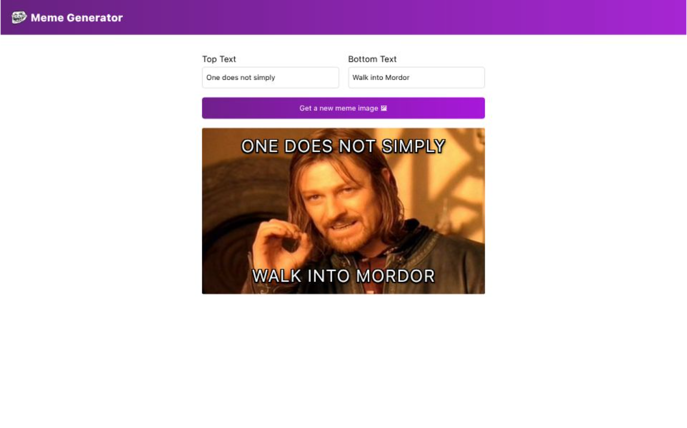

# Meme Generator

A simple meme generator built with React.  
It fetches meme templates from an API and lets you generate your own meme by adding custom text.

## Preview

## Live Demo
https://meme-generator-sable-psi.vercel.app/

## Features
- Fetches meme templates from a public API
- Generates a random meme image
- Top and bottom text inputs
- Responsive layout

## Technologies
- React
- JavaScript
- Vite
- CSS

## How to run locally
npm install
npm run dev
